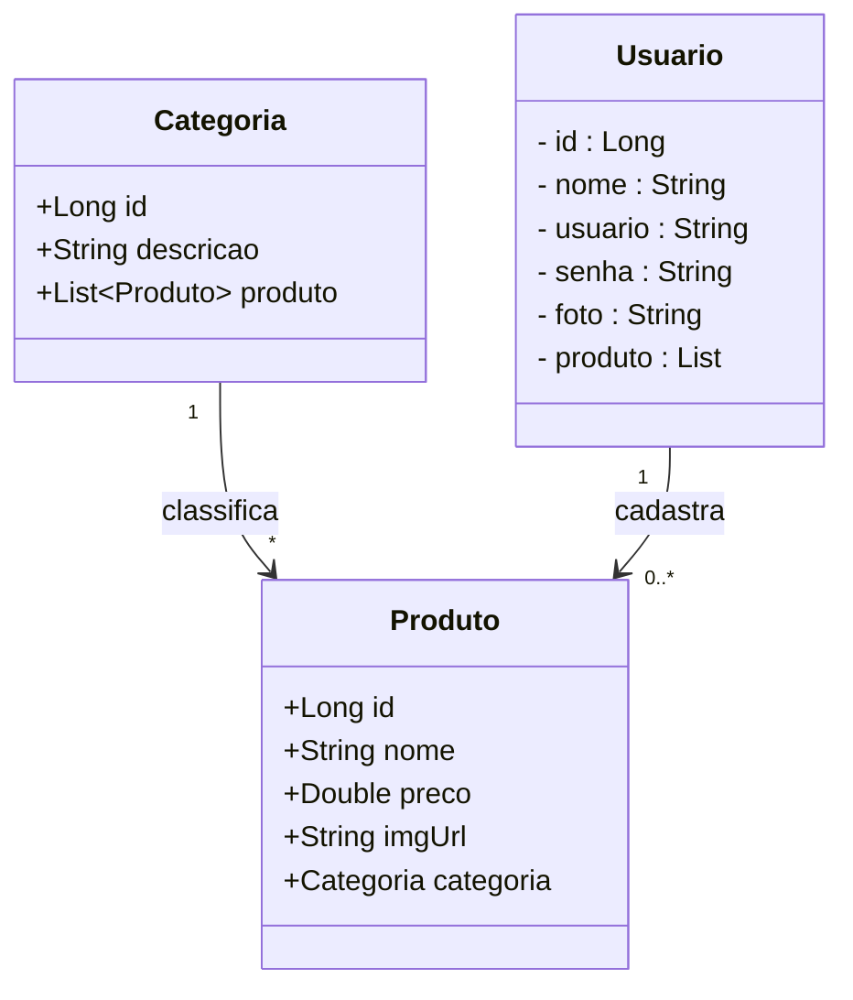
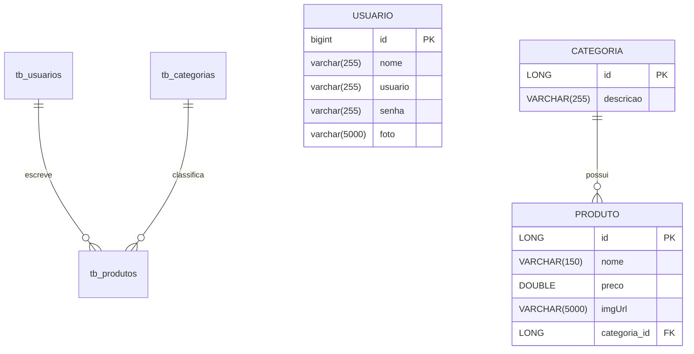

# Projeto E-commerce de Farmácia - Backend com Spring Boot

 

     

 

  
  
  
  
  
  
  

 

## 1. Descrição

 

O **e-commerce de farmácia** é uma aplicação que permite que usuários publiquem, editem e visualizem produtos relacionados a categorias variadas, de forma organizada e segura. Este projeto foi desenvolvido com fins educacionais, simulando uma aplicação real de e-commerce de farmácia para praticar conceitos de API REST com Java e Spring Boot.

Entre os principais recursos que e-commerce de farmácia oferece, destacam-se:

1. Criação, edição e exclusão de produtos e categorias
2. Associação de produtos a categorias específicas e usuários
3. Listagem de produtos e categorias filtradas por ID ou Nome/Descrição
4. Listagem de produtos de acordo com o parâmetro de preço recebido
5. Cadastro e autenticação de usuários

 

## 2. Sobre esta API

 

A API do e-commerce de farmácia foi desenvolvida utilizando **Java** e o **framework Spring**, seguindo os princípios da Arquitetura MVC e REST. Ela oferece endpoints para o gerenciamento dos recursos **Usuário**, **Produto** e **Categoria**.

 

## 3. Diagrama de Classes

 

O **Diagrama de Classes** é um modelo visual usado na programação orientada a objetos para representar a estrutura de um sistema. Ele exibe classes, atributos, métodos e os relacionamentos entre elas, como associações, heranças e dependências.

Esse diagrama ajuda a planejar e entender a arquitetura do sistema, mostrando como as entidades interagem e se conectam. É amplamente utilizado nas fases de design e documentação de projetos.

 

 

## 4. Diagrama Entidade-Relacionamento (DER)

 

O **DER (Diagrama Entidade-Relacionamento)** do projeto **E-commerce de Farmácia** representa de forma visual como os dados estão organizados no banco de dados relacional e como as entidades se relacionam entre si.

 

 

## 5. Requisitos

 

Para executar os códigos localmente, você precisará:

- [Java JDK 17+](https://www.oracle.com/java/technologies/javase/jdk17-archive-downloads.html)
- Banco de dados [MySQL](https://dev.mysql.com/downloads/)
- [STS](https://spring.io/tools)
- [Insomnia](https://insomnia.rest/download) ou [Postman](https://www.postman.com/)

 
